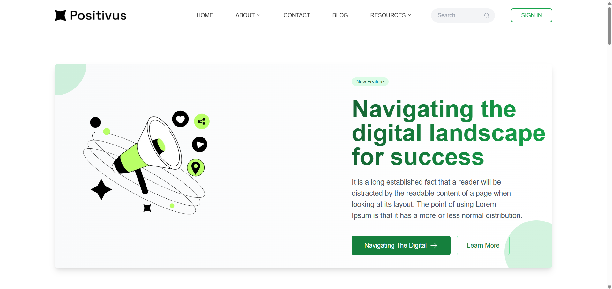
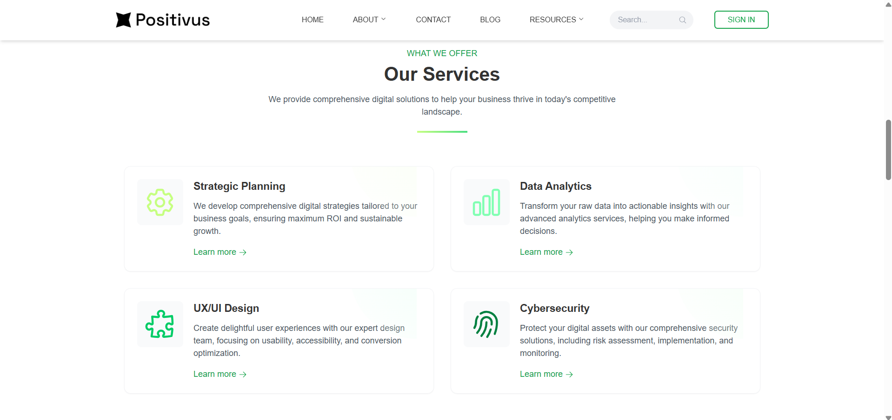
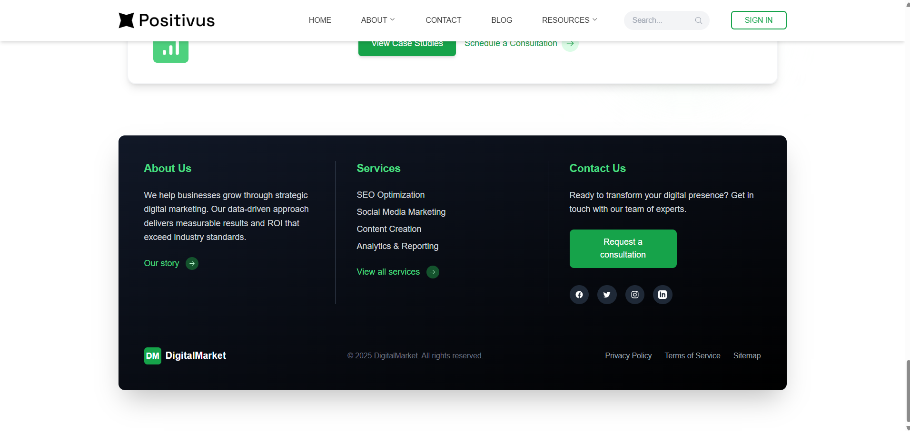

# Digital Marketing Agency Website

A modern, responsive website for digital marketing agencies built with Next.js and Tailwind CSS. This project features a clean design with animated components, a green-themed color scheme, and comprehensive sections to showcase services, client success stories, and agency expertise.


## 🚀 Features

- **Responsive Design:** Fully mobile-friendly layout that adapts to all screen sizes
- **Modern UI/UX:** Clean, professional interface with consistent green theme
- **Animated Components:** Smooth animations and transitions using Framer Motion
- **Component-Based Architecture:** Modular organization for maintainability
- **SEO Friendly:** Built with best practices for search engine optimization
- **Performance Optimized:** Fast loading times and smooth user experience

## 🛠️ Technology Stack

- **Frontend Framework:** [Next.js](https://nextjs.org/) - React framework for production
- **UI Styling:** [Tailwind CSS](https://tailwindcss.com/) - Utility-first CSS framework
- **Animation:** [Framer Motion](https://www.framer.com/motion/) - Animation library
- **Icons:** [Heroicons](https://heroicons.com/) and [MUI Icons](https://mui.com/material-ui/material-icons/)
- **Styling Enhancement:** [Emotion](https://emotion.sh/) - CSS-in-JS library

## 📂 Project Structure

```
src/
├── app/
│   ├── globals.css       # Global styles
│   ├── layout.js         # Root layout
│   └── page.jsx          # Home page
├── components/
│   ├── AnimationWrapper.jsx  # Animation container component
│   ├── Banner.jsx        # Hero banner section
│   ├── Contents.jsx      # Services content section
│   ├── EndSection.jsx    # Case studies section
│   ├── Footer.jsx        # Site footer
│   ├── Hero.jsx          # Logos and stats section
│   ├── Icons.jsx         # SVG icon components
│   ├── Navbar.jsx        # Navigation bar
│   ├── Other.jsx         # Additional services section
│   └── SectionTwo.jsx    # Call-to-action section
└── public/
    └── img/              # Image assets
```

## 🔧 Getting Started

### Prerequisites

- Node.js (v16+ recommended)
- npm or yarn

### Installation

1. Clone the repository:
   ```bash
   git clone https://github.com/yourusername/Social-media.git
   cd Social-media
   ```

2. Install the dependencies:
   ```bash
   npm install
   # or
   yarn
   ```

3. Run the development server:
   ```bash
   npm run dev
   # or
   yarn dev
   ```

4. Open [http://localhost:3000](http://localhost:3000) in your browser to see the result.

## 📋 Page Structure

The homepage (`page.jsx`) is composed of the following sections:

1. **Navbar** - Main navigation
2. **Banner** - Hero section with main value proposition
3. **Hero** - Showcase of logos or key statistics
4. **Other** - Additional services or features
5. **Contents** - Main service offerings
6. **SectionTwo** - Secondary call-to-action or benefits
7. **EndSection** - Case studies or testimonials
8. **Footer** - Site footer with links and contact information

## 🎨 Customization Guide

### Theming

The site uses a green theme throughout. Main color classes used:
- Primary: `text-green-600`, `bg-green-600`
- Secondary: `text-green-400`, `bg-green-400` 
- Accent: `text-[#c6ff81]`, `bg-[#c6ff81]`

To change the theme, search and replace these color classes throughout the components.

### Content

Update the content by editing the respective component files in the `src/components` directory.

### Images

Replace the images in the `public/img` directory with your own.

## 🚢 Deployment

### Vercel (Recommended)

The easiest way to deploy this application is using [Vercel](https://vercel.com/), the platform built by the creators of Next.js:

1. Push your code to a GitHub repository
2. Import your project into Vercel
3. Deploy

## 📊 Project Showcase

| Homepage | Services | Case Studies |
|----------|----------|-------------|
|  |  |  |

## 📄 License

This project is licensed under the MIT License - see the LICENSE file for details.

## 🙏 Acknowledgments

- [Tailwind CSS](https://tailwindcss.com/) for the utility-first CSS framework
- [Heroicons](https://heroicons.com/) for the beautiful SVG icons
- [Framer Motion](https://www.framer.com/motion/) for animation capabilities
- [Next.js](https://nextjs.org/) for the React framework

---

Built with ❤️ by [Your Agency Name] © 2024
